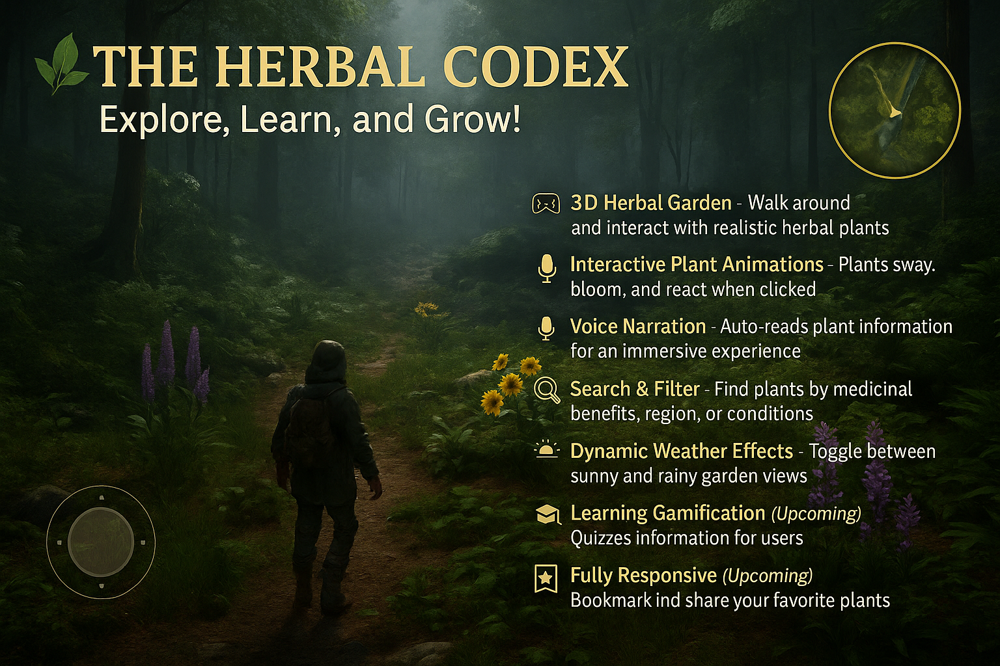

# 🌿 The Herbal Codex  
**An Interactive 3D Herbal Garden for Exploration, Learning, and Fun!** 🚀  

---

## 📖 Project Overview

**The Herbal Codex** is a **3D interactive web application** that lets users explore a virtual herbal garden filled with beautifully rendered **medicinal plants**. Each plant features detailed information including:
- ✅ **Scientific names**
- ✅ **Medicinal uses**
- ✅ **Traditional benefits**
- ✅ **Growing conditions**

Users can walk through the garden, interact with animated plants, and enjoy an **immersive learning experience**. The project blends **education**, **technology**, and **visual storytelling** to make herbal knowledge **accessible, engaging, and fun for everyone**.

---

## ✨ Key Features

- 🎮 **3D Herbal Garden** – Explore a navigable space with realistic plants in a garden setting.
- 🌱 **Interactive Animations** – Plants respond with bloom/sway effects on interaction.
- 🎙️ **Voice Narration** – Auto-reads plant information aloud using Web Speech API.
- 🔍 **Smart Search & Filter** – Find plants based on medicinal benefit, region, or usage.
- 🌦️ **Dynamic Weather** – Switch between sunny and rainy garden environments.
- 📚 **Gamified Learning** *(Upcoming)* – Quizzes, achievements, and plant challenges.
- 🌍 **Multilingual Support** *(Upcoming)* – Information available in Hindi, Gujarati, etc.
- 📱 **Fully Responsive** – Works seamlessly across desktop, tablet, and mobile.
- 📸 **Social Sharing & Bookmarks** *(Upcoming)* – Save and share your favorite herbs.

---

## 🚀 Tech Stack

| Tech                 | Purpose                                  |
|----------------------|------------------------------------------|
| **React.js**         | Building the user interface              |
| **Three.js**         | 3D rendering engine                      |
| **React-Three-Fiber**| React bindings for Three.js              |
| **React-Spring**     | Smooth 3D animations                     |
| **Web Speech API**   | Real-time voice narration of plant data |
| **CSS3**             | Styling and responsiveness               |

---

## 🛠️ How to Run the Project Locally

### 🧑‍💻 Prerequisites
Make sure you have the following installed:
- [Node.js](https://nodejs.org/) (v16 or higher recommended)
- npm (comes with Node.js)

### 📦 Installation Steps

```bash
# Step 1: Clone the repository
git clone https://github.com/Mandora-Manmeetsinh/herbal-codex.git

# Step 2: Navigate to the project directory
cd herbal-codex

# Step 3: Install project dependencies
npm install

# Step 4: Start the development server
npm start
```

### 🌐 Open in Browser
After starting the server, open your browser and go to:
```
http://localhost:3000
```

You're now ready to explore the Herbal Codex!

---

## 📸 Preview

> A glimpse of the Herbal Codex in action:



---

## 💡 Planned Future Enhancements

- 🌍 **Multilingual Translations**: Hindi, Gujarati, and other regional languages.
- 📷 **AR Support**: Augmented Reality plant projection using WebXR or ARKit.
- 🧠 **Quizzes & Leaderboards**: Challenge your herbal knowledge with gamified modules.
- 🌳 **More Realistic Plants**: Import detailed GLTF/GLB models for better visual fidelity.
- 🗂️ **User Profiles & Bookmarks**: Save and revisit favorite herbs or completed zones.

---

## 🤝 Contributors

- 👨‍💻 **Project Lead / Developer**
  [Mandora Manmeetsinh](https://github.com/Mandora-Manmeetsinh)
- 👨‍💻 **UI/UX Developer / Database Manaer**  
  [Astha Kharadi](https://github.com/asthakharadi)

---

## 📜 License

This project is licensed under the **MIT License** – see the [LICENSE](./LICENSE) file for details.

---

> _“Let’s bring nature, healing, and technology together in one magical journey.”_ 🌿✨

---

## 🧭 Ready to Explore the Garden of Wisdom?  
### **Start your journey with The Herbal Codex now!**
